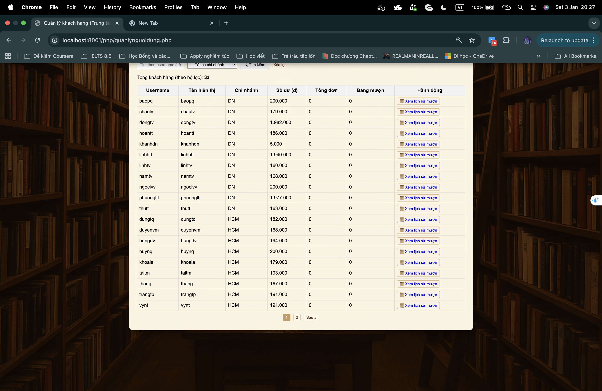
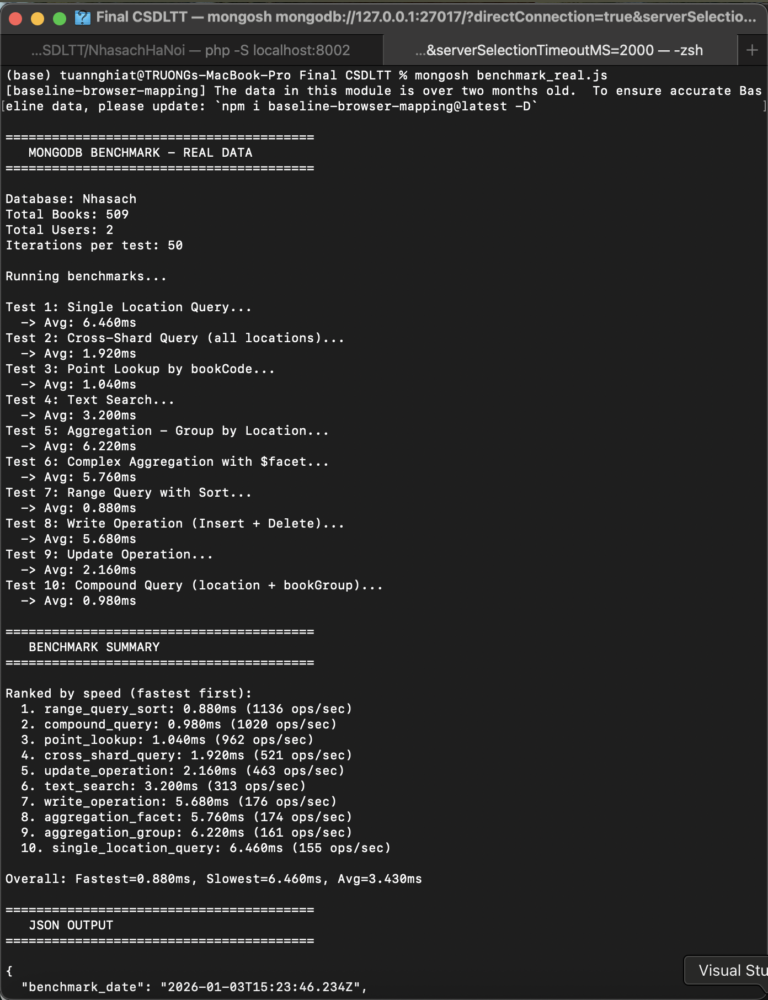

# Báo cáo Cập nhật & Kiểm thử Hệ thống

Tài liệu này tóm tắt các cập nhật mới nhất cho Hệ thống Thư viện điện tử Phân tán, tập trung vào đồng bộ hóa dữ liệu, độ chính xác của Dashboard và quản lý người dùng.
Dưới đây là phân tích các điểm kiểm thử liên kết với các file ảnh chụp màn hình.

## 1. Dashboard Trung Tâm (Thống kê)

**File:** `02_dashboard.png`
**Phân tích:**
Dashboard đã được cập nhật để tổng hợp chính xác dữ liệu từ trung tâm và tất cả các chi nhánh.
- **Điểm kiểm tra chính:** Số lượng "Tổng người dùng" phải hiển thị là tổng của Admins/Nhân viên cục bộ (9) + Khách hàng đã đồng bộ (33), tổng cộng là **42**.
- **Doanh thu & Đơn hàng:** Các biểu đồ hiện lấy dữ liệu từ phép hợp (`$unionWith`) của `orders` và `orders_central`.

---

## 2. Quản lý Người dùng (Chế độ xem tổng hợp)

**File:** `04_quanlynguoidung.png`
**Phân tích:**
Trang `QuanLyNguoiDung.php` hiện hiển thị danh sách người dùng thống nhất.
- **Điểm kiểm tra chính:** Bạn sẽ thấy người dùng có "Chi nhánh" là "Trung Tâm" (cục bộ) xen kẽ với người dùng từ "Hà Nội", "Đà Nẵng", v.v.
- **Bộ lọc:** Bộ lọc "Chi nhánh" hiện bao gồm tùy chọn **"Trung Tâm"** để xem các tài khoản quản trị cục bộ.

---

## 3. Tìm kiếm Sách Toàn cục (Giao diện Khách hàng)

**File:** `05_danhsachsach.png`
**Phân tích:**
Danh sách sách hiển thị cho khách hàng truy vấn cơ sở dữ liệu trung tâm, nơi đã đồng bộ sách từ tất cả chi nhánh.
- **Điểm kiểm tra chính:** Tìm kiếm một tiêu đề sách cụ thể sẽ trả về kết quả bất kể sách đó ban đầu thuộc chi nhánh nào, miễn là quá trình đồng bộ đã chạy.

---

## 4. Dữ liệu Chi nhánh Cụ thể

**File:** `07_branch_books.png` & `09_branch_admin.png`
**Phân tích:**
Các ảnh chụp màn hình này xác minh rằng từng chi nhánh riêng lẻ (ví dụ: Hà Nội) duy trì dữ liệu cục bộ của riêng họ, sau đó được đẩy về trung tâm.
- **Điểm kiểm tra chính:** Đảm bảo dữ liệu ở đây khớp với những gì hiển thị trên danh sách người dùng/sách của Dashboard Trung tâm cho chi nhánh đó.

---

## 5. Quy trình Đồng bộ hóa Tự động (Mới)

**File:** `13_sync_process.png` *(Vui lòng chụp ảnh màn hình mới này)*
**Phân tích:**
Script `force_sync_all.php` đảm bảo tính toàn vẹn dữ liệu bằng cách xóa các mục cũ và đồng bộ lại.
- **Điểm kiểm tra chính:** Output của terminal hiển thị "Synced X users", "Synced Y orders" xác nhận tiến trình chạy ngầm đang hoạt động.

*(Chạy lệnh `php force_sync_all.php` hoặc `sh auto_sync_loop.sh` và chụp lại kết quả)*

---

## 6. Hạ tầng & Benchmark

**Files:** `10_docker.png`, `11_mongodb_compass.png`, `12_terminal_benchmark.png`
**Phân tích:**
Bằng chứng trực quan về kiến trúc MongoDB phân tán và benchmark hiệu năng.

| Docker Containers | MongoDB Data | Benchmark Results |
|-------------------|--------------|-------------------|
|  |  |  |

---
---

# Phân tích Sử dụng Ảnh trong Báo cáo LaTeX

Hiện tại, file báo cáo LaTeX (`report_latex/chapter3.tex`) đang sử dụng **8 file ảnh** sau:
1. `01_login.png`
2. `02_dashboard.png`
3. `03_quanlysach.png`
4. `05_danhsachsach.png`
5. `06_giohang.png`
6. `10_docker.png`
7. `11_mongodb_compass.png`
8. `12_terminal_benchmark.png`

**Các ảnh QUAN TRỌNG đang bị TIẾU:**
1. **`04_quanlynguoidung.png`**: Ảnh này cực kỳ quan trọng để chứng minh lỗi hiển thị sai số lượng người dùng (33 vs 42) đã được sửa.
2. **`07_branch_books.png`**, **`08_branch_orders.png`**: Cần thiết để chứng minh tính chất "Phân tán" của hệ thống (dữ liệu riêng ở từng chi nhánh).
3. **`13_sync_process.png`** (placeholder): Cần thiết để chứng minh tính năng tự động đồng bộ hóa thời gian thực.

**Lời khuyên:**
Bạn **NÊN thêm các ảnh còn thiếu này** vào báo cáo, đặc biệt là ảnh `04_quanlynguoidung.png` và ảnh đồng bộ hóa, vì chúng là bằng chứng trực tiếp cho các vấn đề bạn đã giải quyết trong phiên làm việc này.
